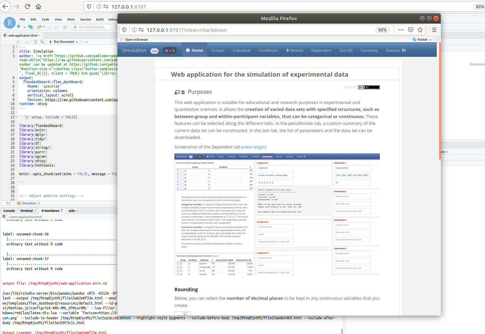

# Web application for the simulation of experimental data

### Purposes

This open-source, R-based web application is suitable for educational and research purposes in experimental and quantitative sciences. It allows the **creation of varied data sets with specified structures, such as between-group and within-participant variables, that can be categorical or continuous.** These features can be selected along the different tabs. In the penultimate tab, a custom summary of the current data set can be constructed. In the last tab, the list of parameters and the data set can be downloaded.

### :globe_with_meridians: &nbsp; The web application can be [launched here](https://pablo-bernabeu.shinyapps.io/experimental-data-simulation/).

<br>

<a href="https://github.com/pablobernabeu/Experimental-data-simulation/raw/master/Screenshot.png"></a>

<br>

### Options for development and local use of the app

#### Option A. Rmd script

Open the script [web-application.Rmd](https://github.com/pablobernabeu/Experimental-data-simulation/blob/master/web-application.Rmd) in RStudio, install the packages suggested by RStudio, and run the application. 

#### Option B. Binder RStudio

Access the [Binder RStudio environment](https://mybinder.org/v2/gh/pablobernabeu/Experimental-data-simulation/master?urlpath=rstudio).

#### Option C. Dockerfile

You can also use the included [Dockerfile](Dockerfolder/Dockerfile). First, build the container:

```bash
docker build -t experiment-shiny-app .
```

And then run the container, selecting a password for the interface and binding to port 8787 on your local machine.

```bash
$ docker run --interactive --rm -e PASSWORD=<MYPASSWORD> -p 8787:8787 --name experiment-shiny-app --volume $(pwd):/home/rstudio experiment-shiny-app
[s6-init] making user provided files available at /var/run/s6/etc...exited 0.
[s6-init] ensuring user provided files have correct perms...exited 0.
[fix-attrs.d] applying ownership & permissions fixes...
[fix-attrs.d] done.
[cont-init.d] executing container initialization scripts...
[cont-init.d] add: executing... 
Nothing additional to add
[cont-init.d] add: exited 0.
[cont-init.d] userconf: executing... 
[cont-init.d] userconf: exited 0.
[cont-init.d] done.
[services.d] starting services
[services.d] done.
```

You can then open [127.0.0.1:8787](127.0.0.1:8787) to see the interface and login with username "rstudio" and
your chosen password. You can then select the Rmd file and click "Run Document" to generate the window for the application,
shown below.



<br>

### Reference

Bernabeu, P., & Lynott, D. (2020). Web application for the simulation of experimental data (Version 0.2). Retrieved from [https://github.com/pablobernabeu/Experiment-simulation-app/](https://github.com/pablobernabeu/Experiment-simulation-app/).

### Code

This web application was developed in [R](https://www.r-project.org/about.html) (R Core Team, 2020). The code is [available on Github](https://github.com/pablobernabeu/Experimental-data-simulation/blob/master/web-application.Rmd), where contributions may be made. The initial code for this application was influenced by Section 5.7 in Crump (2017; [*Simulating data for multi-factor designs*](https://crumplab.github.io/programmingforpsych/simulating-and-analyzing-data-in-r.html#simulating-data-for-multi-factor-designs)). The R packages used include Shiny (Chang, Cheng, Allaire, Xie, & McPherson, 2020), Tidyverse (Wickham et al., 2019) and DT (Xie, 2020).

### Acknowledgements

Thank you to RStudio for the free hosting server used by this application, [shinyapps.io](https://www.shinyapps.io/).

### References

<div style = "text-indent:-1.5em; margin-left:1.5em;">

Chang, W., Cheng, J., Allaire, J., Xie, Y., & McPherson, J. (2020). shiny: Web Application Framework for R. R package version 1.4.0. Available at [http://CRAN.R-project.org/package=shiny](http://CRAN.R-project.org/package=shiny).

Crump, M. J. C. (2017). Programming for Psychologists: Data Creation and Analysis (Version 1.1). [https://crumplab.github.io/programmingforpsych/](https://crumplab.github.io/programmingforpsych/).

R Core Team (2020). R: A language and environment for statistical computing. R Foundation for Statistical Computing, Vienna, Austria. URL [https://www.R-project.org/](https://www.R-project.org/).

Wickham, H., Averick, M., Bryan, J., Chang, W., McGowan, L. D. A., Fran&ccedil;ois, R., ... Kuhn, M. (2019). Welcome to the Tidyverse. *Journal of Open Source Software, 4*(43), 1686. [https://doi.org/10.21105/joss.01686](https://doi.org/10.21105/joss.01686).

Xie, Y. (2020). DT: A Wrapper of the JavaScript Library "DataTables". R package version 0.14. Available at [https://CRAN.R-project.org/package=DT](https://CRAN.R-project.org/package=DT).

</div>

### Contact

To submit any questions or feedback, please post [an issue](https://github.com/pablobernabeu/Experimental-data-simulation/issues), or email Pablo Bernabeu at [p.bernabeu@lancaster.ac.uk](mailto:p.bernabeu@lancaster.ac.uk).
